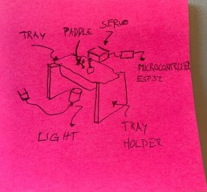

# Servo paddle
## the challenge

1: Create a paddle ( or anything that distrubbs water ) and attach it to a servo.

2: Connect the servo to the arduino. and make it move back and forth in a loop. for ever.

3: attach the servo to the water tray

4: left the water so we can put a light below.

see image below for the setup
<!-- insert image -->

